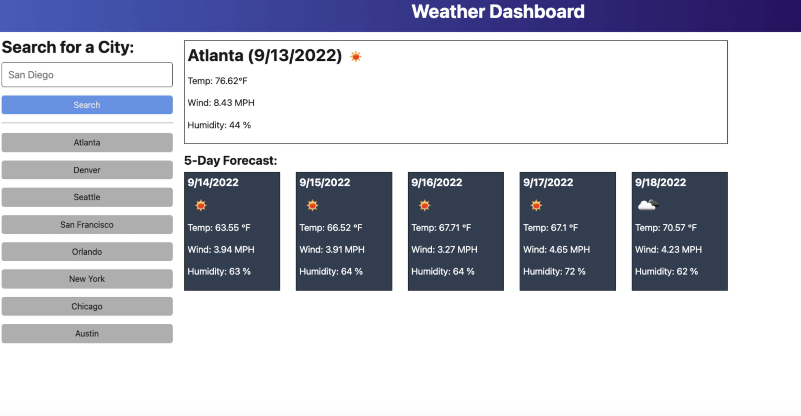

# Weather Dashboard :sun_behind_rain_cloud:

This browser applicationis a weather dashboard that features dynamically updated HTML and CSS. It is retrieves data from another application's API. This goal is to see a weather outlook of multiple cities
so user can plan a trip accordingly.

Deployed Site: [Weather Dashboard](https://armandosjunior.github.io/Weather-Dashboard/) :sob:

---

### **Some Technical Features Include:**
```
- Presenting user with current and future conditions for that city and that city is added to the search history

- User has a display of city name, date, an icon representation of weather conditions, the temperature, the humidity, and the the wind speed

- Current and future conditions for selected city
```
---

### **Application Mock Up:**


---
### **Technology used:**
```
- Javascript
- HTML
- Server-Side API
```

---

### **Steps for future development:**
```
- successfully connect to api 
```
